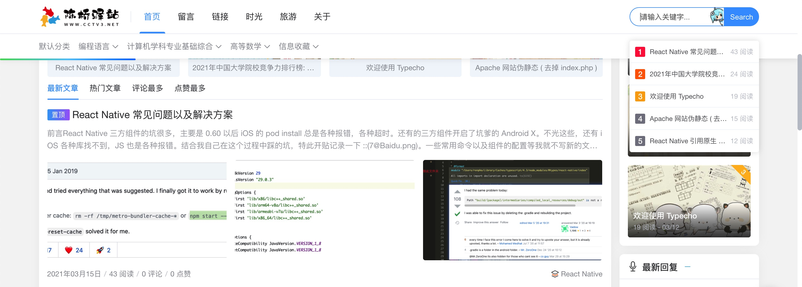

# 项目概述

## React Native 版本

`RenphoECG→0.59.10` 和 `RenphoECG→0.63.4`
最开始的时候项目使用的 `React Natiive` 的版本是 `0.59.10`。但是后来 `iOS` 因为 `UIWebView` 没法上架，所以升级到 `0.63.4`。

## 分支

目前总共有两个分支。

- `master`

  所有的开发基本上都是在这个分支上面做的开发。

  - `Testing→SingleTest+MultiTest` 当时测量模式一二三都在一个页面里面，处理起来逻辑比较麻烦，所以把公用的部分简单的服用了一下，拆分了两个业务，单步测量以及多步测量。

  - `TestingBattery4iOS` 针对 `iOS` 电池电量显示异常所做的修改。

## Class or Hooks ?

最开始的时候一般用的 `Class` 组件，后来发现一些复杂业务可能里面要维护两套生命是周期 ( component 和 navigation )，所以逐渐改为 `Hooks` 组件了。

## 依赖

清务必保持各个版本的版本号对应，避免出现不兼容的情况。

```json title="package.json"
"dependencies": {
    "@react-native-async-storage/async-storage": "^1.15.2",
    "@react-native-community/masked-view": "^0.1.10",
    "@react-native-community/progress-bar-android": "^1.0.4",
    "@react-native-community/progress-view": "^1.2.4",
    "@react-navigation/native": "^5.9.2",
    "@react-navigation/stack": "^5.14.1",
    "lodash": "^4.17.21",
    "moment": "^2.29.1",
    "prop-types": "^15.7.2",
    "react": "16.13.1",
    "react-native": "0.63.4",
    "react-native-animatable": "^1.3.3",
    "react-native-banner-carousel": "^1.0.3",
    "react-native-cardview": "^2.0.5",
    "react-native-fast-image": "^8.3.4",
    "react-native-fs": "^2.17.0",
    "react-native-gesture-handler": "^1.10.3",
    "react-native-indicators": "^0.17.0",
    "react-native-linear-gradient": "^2.5.6",
    "react-native-pdf": "^6.3.0",
    "react-native-picker": "^4.3.7",
    "react-native-reanimated": "^2.1.0",
    "react-native-safe-area-context": "^3.2.0",
    "react-native-screens": "^3.1.1",
    "react-native-share": "^6.0.1",
    "react-native-swipeout": "^2.3.6",
    "react-native-webview": "^11.4.0",
    "react-redux": "^5.1.0",
    "reactotron-react-native": "^5.0.0",
    "redux": "^4.0.4",
    "redux-devtools-extension": "^2.13.8",
    "redux-persist": "^5.10.0",
    "redux-thunk": "^2.3.0",
    "rn-fetch-blob": "^0.12.0"
  },
```

## 常用命令

### 打包

`iOS`: `XCode` 打包不用命令。

`Android`: 切换到项目的根目录。

详细配置过程可以参考博客 http://www.cctv3.net/archives/ReactNativeBuildAPK.html 。

```shell
cd android && ./gradlew assembleRelease
```

### 清除缓存

可能调试过程中会出现缓存的影响，**建议关闭 Server**。

```shell
npm start --cache-clean
```

## 其他问题

关于项目开发中可能遇见的其他问题，基本上都在我的博客里面写过总结了，可以访问我的博客 http://www.cctv3.net 。

